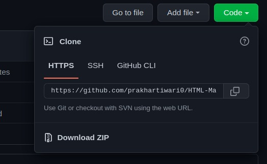

## <ins>HTML &harr; MarkDown Converter</ins>

### About
This an open source python program that can : 
- Convert HTML tags to Markdown command
- Convert Markdown command to HTML code

### Screenshot :framed_picture:


### How to use?
You need to have Python Installed on your computer, to know more about Python visit [here](https://wiki.python.org/moin/BeginnersGuide/Download) or directly download it from [Download Page](https://www.python.org/downloads/).<br>
Simply open command line in the directory where `converter.py` is present, and execute the file using following command :
```
$ python3 converter.py
```

Or you can also use the Python IDLE, or any other code editor for this purpose.

After that, just follow the steps that program asks you to do.
- Once you run the `converter.py` file, an `input.txt` file gets generated in the current folder
- You will need to put the original code(HTML or Markdown) into that `input.txt` file, and then press ENTER. 
- After that, the program will convert that code to your desired format, and put the converted code into `output.txt` file. 


## How to Contribute? 🤔
It is very easy to contribute to this project, and it will be really helpful especially if you are a beginner in Python or just want to practice. 🔰

1. Fork this repo. You can fork the repo by clicking "fork" button on top-right corner.
<p align="left"></p>

2. Clone it on your local machine by simply clicking green "code" button and copying the given link.
<p align="left"></p>

Copy this link and open command prompt and switch to the location you want to save the project and run 
```git clone <copied link here>```

3. Add your changes or features.

4. Before pushing the code run following command to avoid merge conflicts
``` bash
git remote add upstream https://github.com/prakhartiwari0/HTML-MarkDown-Converter.git
git fetch upstream
git pull upstream <branch_name>
```
5. Stage all the changes using ```git add .```

6. Add commit message ```git commit -m "<your message here>"``` and push the code using ```git push <remote name> <branch name>```

7. Then go to the main repo from where the project is forked and go into **Pull Request** tab.


8. Click **New pull request**.


9. Select the branch from forked repo you have contributed to and want to merge to the main repo and click **Create pull request** button.


10. You can also raise any new issue or work on existing issue by clicking on **Issues** tab.


And bam!:fire: thats it.

Happy Contributing! 😇
